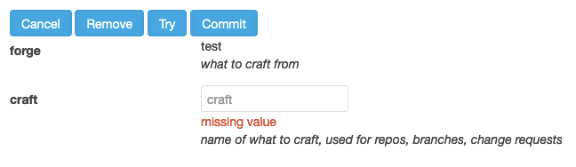

# CnC Forge - Forging

Forging is the process of taking a Forge and creating Pull Requests (and possibly Repos).

The CnC Forge is metaphporically named. A CNC (computer numerical control) machine takes in a pattern
defined by the operator and uses that pattern to modify sone material. A 3D printer is actually a CNC
machine.

That would be enough, but us nerds like to pretend we're Vikings or Blacksmiths or some other silly
bullshit, so I threw "forge" on the end of it. Plus "forging" sounds cooler than "CNC'ing".

# Actions

Forging has three actions: Commit, Try, and Remove.

## Commit

This is the most common action. It forges the code and then commits it, making a Pull Request, and
even Repos, Webhooks on the Repo, even Comments on the Pull Request.

## Try

This is mainly used for development. It forges the code but doesn't commit it, leaving it instead in
the `cnc` directory. Check out [Developing](Developing.md) for more.

## Remove

This is the least common action. In fact, at the time of this writing, I've only used it in testing.
What this does is reverse a forge by setting `remove: true` all the way down to the `output`. So where
it added a file, it'll remove that file. Where it added a value to an array in a file, it'll remove
the value from the array.

# Usage

All these actions came about as how the CnC Forge evovled over time.

## Services

The CnC Forge earliest predecessors were used to create Services. Whatever pattern we were using
at the time, I created a template Repo or two. You clone a Repo, run a mass search and replace, and
then commit as a new Repo.

Later, with the CnC Forges more recent predecessor known as the svc-forge, that started creating
Repos. Again, this was mainly used to create new Repos from scratch and only for Services, which the
CnC Forge is still absolutely great for.

## Standards

One of the first side effects first noticed from early predecessors is that once people started using the
process, everyone's services started looking pretty much the same at the base. I realized that we
could proliferate standards without all the arguments. You want to do everything from scratch your
way? That's fine and have fun creating Kubernetes YAML from sratch and REALLY make sure you updated
your Terraform state locations. But if you want to get right to writing the code you actual care about,
use this process and everyone wins.

## IasC

These days I use the CnC Forge for Infrastructure as Code as well. I've been working in some flavor
of SRE for the better part of 5 years. More recently, I've become a proponent of IasC. It's a lot
easier to repeat and scale if you can cut and paste and modify. Even when you abstract things out,
eventually you need the names and what other names they connect to.

Last couple of places I've worked I implement a policy of anything dev or above (not POC) needs to
be IasC. I've also implemented a pattern of each area, like an AWS Region or a GCP project, or a
Kubernetes cluster, needs to have its own *-infra Repo - one place where we can see everythihg
done to that particular section of Infrastructure.

Merged with forging Servics, I've been able to not just create a Service from scratch, but
automatically create CICD pipelines with Jenkins, GitHub actions, or ArgoCD. The ability to make
changes to files, whether text, JSON, or YAML, adding to lists etc, all have made for a very smooth
process of creating services.

## Integration

Now that the CnC Forge has the ability to remove files and undo forging, I'm using it to maintain
Services and Infra. Part of IasC is adding resources to an Inventory service. With [Options](Options.md)
the CnC Forge can now query that same Inventory service for selections, which upped the game two ways.

First, with every area being IasC, I can cascade Infra. I can forge a new region in AWS. When I go
forge a new EKS cluster, that region is now a selection for where to put it. Then when I go to create
a new service, that cluster is available to deploy to. In all these cases, I fill out a simple form,
clone a repo, run Terraform and done.

Second, if I want to make a mass change to existing Infra Repos, I can have the CnC Forge query all
the relevant resources to a checkboxes field (options and multi) swap out the craft field for that
multi select one, and make Pull Requests on dozens of Repos. Honestly, it's pretty great.

## GitOps

But it can be better. I want to be able to have all those Pull Requests automatically run. The pattern
I've liked in the past is to make a Pull Request that tells me what will happen, then type like
`/approve` on the Pull Request and have it run.

With CnC Forge's ability to add comments, I can start with having Pull Requests created waiting for
approval and once that seems stable enough, just have it auto approve when the Pull Request is created.
Going back to integration, that means all I have to do is fill out the form, click Commit, and everything
will just automatically come up, all within the standards on how we want to do things.
