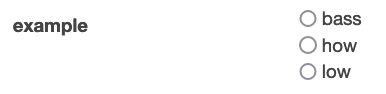

# CnC Forge - Options

You can retrieve both field options and even titles via API calls.

- [Usage](#Usage) - Usage patterns
  - [simple](#simple) - Minimal example
  - [complex](#complex) - Full example
- [Authorization](#Authorization) - Accesing protected API's
  - [basic](#basic) - Username and Password auth
  - [token](#token) - Token auth
- [Settings](#Settings)
  - [url](#url) - Base url to use
  - [path](#path) - Path to add to base url
  - [results](#results) - Key to access list of items
  - [option](#option) - Key to access option value in an item
  - [title](#title) - Key to access option value in an item
  - [creds](#creds) - Credentials to use
  - [verify](#verify) - TLS verrification
  - [params](#params) - URL parameters to send
  - [method](#method) - HTTP Method to use
  - [body](#body) - JSON body to send
  - [headers](#headers) - HTTP Headers to send

This allows for integration across an organization, especially with like an inventory system.

The examples actually work if you're running locally as I've set up an extra API called
options, which is accessible internally as `options.cnc-forge` and accessible externally
as http://localhost:36770/simple and http://localhost:36770/complex.

# Usage

## simple

To use API ettings for options, have options be a dict, like so:

```yaml
description: An example
input:
  fields:
  - name: example
    options:
      url: http://options.cnc-forge/simple
```

And since that endpoint http://localhost:36770/simple returns the following data:

```json
[
    "people",
    "stuff",
    "things"
]
```

Then that would display as:


## complex

Say our data is more complex, like http://localhost:36770/complex

```json
{
    "fruits": [
        {
            "id": 1,
            "name": "apple",
            "meta": {
                "fancy": "Apple"
            }
        },
        {
            "id": 2,
            "name": "pear",
            "meta": {
                "fancy": "Pear"
            }
        },
        {
            "id": 3,
            "name": "orange",
            "meta": {
                "fancy": "Orange"
            }
        }
    ]
}
```

and we want to use the id as the option and the fancy name as the title. Here's how we'd do that:

```yaml
description: An example
input:
  fields:
  - name: example
    options:
      url: http://options.cnc-forge/complex
      results: fruits
      option: id
      title: meta__fancy
```

The listing of what we want is at the `fruits` key in the payload. For each item return the `id` field
is what we want for the option value. The field `fancy` in the `meta` field is where the title is and
we can specify that multi dimensional path using [overscore](https://pypi.org/project/overscore/).

Which all displays as:


# Authorization

Some API's require Authorization and Authorization requires information, usually secret information.
Like with [GitHub](GitHub.md) options can have auth info, it just needs to be secret.

The CnC Forge uses one secret in the `cnc-forge` Kubernetes namespace, esoterically called `secret`.

All Options creds files are prefixed with `option_`, and each set of creds requires a single json file
with the name of the creds following the underscore.

In all cases, put these files in the same `secret` like with [GitHub](GitHub.md).

## basic

The endpoint `http://options.cnc-forge/basic` requires the username of `my` and the password of `self` and returns
data simply as:

```json
[
    "bass",
    "how",
    "low"
]
```

First we add a file `options_basic.json` in the `secret`:

```json
{
    "username": "my",
    "password": "self"
}
```

Here's our forge referencing those credentials (the part after _ in the file name):

```yaml
description: An example
input:
  fields:
  - name: example
    options:
      creds: basic
      url: http://options.cnc-forge/basic
```

Which displays as:



## token

The endpoint `http://options.cnc-forge/token` requires the token of `funspot` and returns
data simply as:

```json
[
    "galaga",
    "pacman",
    "defender"
]
```

First we add a file `options_token.json` in the `secret`:

```json
{
    "token": "funspot"
}
```

Here's our forge referencing those credentials (the part after _ in the file name):

```yaml
description: An example
input:
  fields:
  - name: example
    options:
      creds: token
      url: http://options.cnc-forge/token
```

Which displays as:


# Settings

All the fields in the `options` dict and all the fields in the `options-*.json` file are
interchangeable. All `creds` really does is find a matching file and update whatever's in
the dict with what's in the `options` and uses that for settings.

## url

This is the base url to use with every call. This can be the full url to call or it can
be a base url you put in the config file and then use the `path` setting for each different
API call.

## path

(optional) Used with `url` to specify the full url to hit. For example if your settings
file is `options_split.json`:

```json
{
   "url": "http://api.mysite"
}
```

And your field is:

```yaml
description: An example
input:
  fields:
  - name: example
    options:
      creds: split
      path: stuff
```

Then the actual url hit will be `http://api.mysite/stuff`

## results

(optional) This is the key specifying the list of results in the return payload.

For example if your return data is:

```json
{
    "things": [1, 2, 3]
}
```

Your forge should have this setting:

```yaml
description: An example
input:
  fields:
  - name: example
    options:
      results: things
```

But if your return data is:

```json
[1, 2, 3]
```

Your forge should not have a `results` setting at all

## option

(optional) This is the key specifying what you want for option values.

For example if your return data is:

```json
[
  {"value": 1},
  {"value": 2},
  {"value": 3}
]
```

Your forge should have this setting:

```yaml
description: An example
input:
  fields:
  - name: example
    options:
      option: value
```

But if your return data is:

```json
[1, 2, 3]
```

Your forge should not have a `option` setting at all

## title

(optional) This is the key specifying what you want for title values.

For example if your return data is:

```json
[
  {"value": 1, "word": "One"},
  {"value": 2, "word": "Two"},
  {"value": 3, "word": "Three"}
]
```

Your forge should have this setting:

```yaml
description: An example
input:
  fields:
  - name: example
    options:
      option: value
      title: word
```

## creds

(optional - default 'default') This the creds file to use. If not specified, it will assume `default`
and try to load that file, skipping if it can't find it.

All files should be named like `options_yourcreds.json` and you'd use `yourcreds` for the `creds` setting.

## verify

(optional - default True) Use this if you're using https on something INTERNAL YOU CAN TRUST. Yes, we should
always have all our certs set up in production and all that. But if you're just dicking around or know enough
about security and risk and have mitigated other ways, set this to false and carry on, unashamed.

## params

(optional) Parameters to use in the url. For example, if your forge is:

```yaml
description: An example
input:
  fields:
  - name: example
    options:
      url: http://api.mysite.com
      params:
        name: John
        status: Married
```

The url use will be `http://api.mysite.com?name=John&status=Married`

## method

(optional - default 'GET') The method to use. Use this if you have a fancy query that requires like a
POST instead of a GET.

## body

(optional) JSON body to use in the request. For example, if your forge is:

```yaml
description: An example
input:
  fields:
  - name: example
    options:
      url: http://api.mysite.com
      method: POST
      body:
        filter:
          name: John
          status: Married
```

The request body will be:

```json
{
    "filter" {
        "name": "John",
        "status": "Married"
    }
}
```

Note that we used a POST method.  Different API's work differently but technically GET requests aren't
supposed to have bodies. While you can do whatever you want, I've found less headaches adapting my POST
methods rather fighting industry standards. And yes, I've tried. Lord knows, I have tried.

## headers

(optional) If you need to send special headers, use this setting like so:

```yaml
description: An example
input:
  fields:
  - name: example
    options:
      url: http://api.mysite.com
      header:
        My-Header: My Value
```
