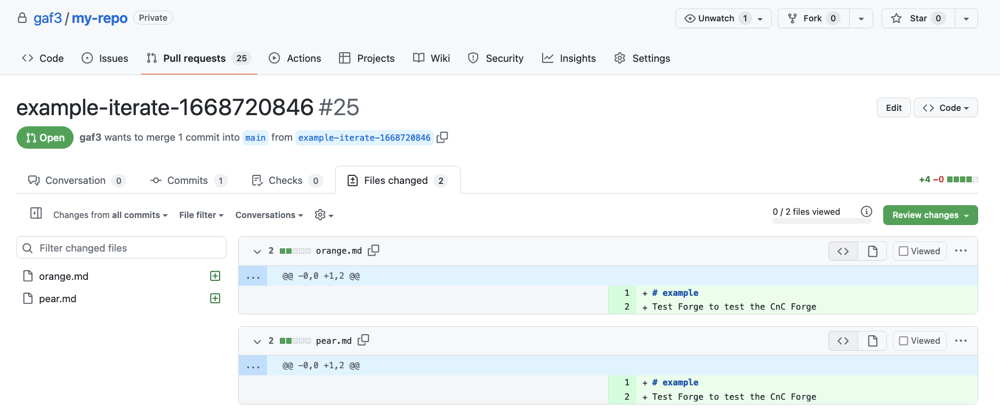

# CnC Forge - Output

The `output` section of a forge defines what fields and how they all work.

- [code](#code) - Making a Pull Request
- [change](#change) - Pulling code from another Repo for changes
- [content](#content) - Adding content to a Pull Request
  - [source](#source) - Specifying the content source
    - [file](#file) - Sourcing a file
    - [directory](#directory) - Sourcing a directory
    - [glob](#glob) - Sourcing files and direcotries with *
    - [value](#value) - Sourcing a raw value without a file
  - [destination](#destination) - Specifying the content destination
  - [exclude](#exclude) - Excluding files and directories from a glob source
  - [include](#include) - Including files and directories that were excluded from a glob source
  - [preserve](#preserve) - Preserving (not transforming) files and directories from a glob source
  - [transform](#transform) - Transforming files and directories that were preserved from a glob source
  - [text](#text) - Adding text to files
    - [append](#append) - Appending text to a file
    - [place](#place) - Placing text in a file
  - [json](#json) - Appending to an array in a JSON file
  - [yaml](#yaml) - Appending to an array in a YAML file
- [universal](#universal) - Settings common to `code`, `change`, and `content` blocks
  - [remove](#remove) - Remove content
  - [condition](#condition) - Only add under certain conditions
  - [iterate](#iterate) - Iterate through an array of values repeating the block
  - [transpose](#transpose) - Replacing one value with another's
  - [blocks](#blocks) - Group blocks under a single condition or iteration.

# code

A `code` block is is used to make a Pull Request. It can be a single block:

```yaml
description: An example
output:
  code:
    github:
      repo: my-repo
    change: ..
```

Or an array of blocks:

```yaml
description: An example
output:
  code:
  - github:
      repo: my-repo
    change: ...
  - ...
  - ...
```

## github

A code block should contain a `github` block (until I support equivalents)
which tells the forge how to create the Pull Request. Consult the
[GitHub code](Github.md#code) docs for more info.

If the Repo doesn't exists, it'll create it and add a `CNC` file which just contains
the id of the CNC. This is done because it makes it easier to check out the code for
changes and works well with idempotency.

A `code` block should also contain one or more `change` blocks.

# change

A `change` block specifies where to pull code from. It can also just be a single block:

```yaml
description: An example
output:
  code:
  - github:
      repo: my-repo
    change:
      github:
        repo: gaf3/test-forge
      content: ...
```

Or an array of blocks:

```yaml
description: An example
output:
  code:
  - github:
      repo: my-repo
    change:
    - github:
        repo: gaf3/test-forge
      content: ...
    - ...
```

## github

A `change` block should contain a `github` block (until I support
equivalents) which merely tells the forge where to pull templates from. Consult the
[GitHub change](Github.md#change) docs for more info.

A `change` block should also contain one or more `content` blocks.

# content

A `content` block specifies content. Where to pull it from. Where to put it to. It can
also just be a single block:

```yaml
description: An example
output:
  code:
  - github:
      repo: my-repo
    change:
      github:
        repo: gaf3/test-forge
      content:
        source: ...
```

Or an array of blocks:

```yaml
description: An example
output:
  code:
  - github:
      repo: my-repo
    change:
      github:
        repo: gaf3/test-forge
      content:
      - source: ...
      - ...
      - ...
```

## source

The `source` setting specifies where to pull code from the repo specified in the change block.

If not specified, it'll take the `destination` as it's default.

### file

The `source` setting can be relative path to a file:

```yaml
description: An example
output:
  code:
  - github:
      repo: my-repo
    change:
      github:
        repo: gaf3/test-forge
      content:
        source: README.md
```

This is the file in the [gaf3/test-forge](https://github.com/gaf3/test-forge) Repo:


Running the forge like so:


Produces the folling Pull Request:


As you can see, the README.md was taken from gaf3/test-forge, transformed according
to the variables set, and put in the same location in gaf3/my-repo.

### directory

The `source` setting can be relative path to a directory which will copy the entire directory:

```yaml
description: An example
output:
  code:
  - github:
      repo: my-repo
    change:
      github:
        repo: gaf3/test-forge
      content:
        source: people
```

This is the directory in the [gaf3/test-forge](https://github.com/gaf3/test-forge) Repo:


Running the forge like so:


Produces the folling Pull Request:


As you can see, all the files from gaf3/test-forge/people were copied to the same
spot in gaf3/my-repo.

### glob

The `source` setting can be glob, a path with an `*`. That will only transfer files
and directories that match the pattern.

```yaml
description: An example
output:
  code:
  - github:
      repo: my-repo
    change:
      github:
        repo: gaf3/test-forge
      content:
        source: people/*u*
```

This is what's in the the directory in the [gaf3/test-forge](https://github.com/gaf3/test-forge) Repo:


Only the stuff file has a 'u' in it.

Running the forge like so:


Produces the folling Pull Request:


### value

The `source` setting can have a `value` setting which allows you to specify the raw value to use
rather than looking up a file.

```yaml
description: An example
output:
  code:
  - github:
      repo: my-repo
    change:
      github:
        repo: gaf3/test-forge
      content:
        source:
          value: "{{ craft }} is done\n"
        destination: done.txt
```

Notice you need to specify a `destination` setting in this case. All the other example did have a
`destination` - they used `source` as the default.

Running the forge like so:


Produces the folling Pull Request:


As we can see there's a new file `done.txt` which has the text we specified in the value.

## destination

The `source` setting specifies where to pull code from the repo specified in the change block.

If not specified, it'll take the `destination` as it's default.

All the destination is the path where to put content. It can be specified differently than the
source like so:

```yaml
description: An example
output:
  code:
  - github:
      repo: my-repo
    change:
      github:
        repo: gaf3/test-forge
      content:
        source: README.md
        destination: "{{ craft }}.md"
```

Running the forge like so:


Produces the folling Pull Request:


Same file, but now it's named `example.md`

## exclude

If you're referencing a lot of files with a directory or glob source, and want
to exclude some, use an `exclude` setting.

```yaml
description: An example
output:
  code:
  - github:
      repo: my-repo
    change:
      github:
        repo: gaf3/test-forge
      content:
        source: /
        exclude: change.*
```

This is what's in the [gaf3/test-forge](https://github.com/gaf3/test-forge) Repo:


Running the forge like so:


Produces the folling Pull Request:


Notice how all the files are copied except for the change files.

## include

If you referenced a lotof files with an exclude block and what to still include a few,
use an include block:

```yaml
description: An example
output:
  code:
  - github:
      repo: my-repo
    change:
      github:
        repo: gaf3/test-forge
      content:
        source: /
        exclude: change.*
        include: "*.text"
```

This is what's in the [gaf3/test-forge](https://github.com/gaf3/test-forge) Repo:


Running the forge like so:


Produces the folling Pull Request:


Notice how all the change files are exclude except for the `change.text` file.

## preserve

If you're referencing a lot of files with a directory or glob source, and want
to preserve some, use an `preserve` setting.

```yaml
description: An example
output:
  code:
  - github:
      repo: my-repo
    change:
      github:
        repo: gaf3/test-forge
      content:
        source: /
        preserve: README.*
```

This is the file in the [gaf3/test-forge](https://github.com/gaf3/test-forge) Repo:


Running the forge like so:


Produces the folling Pull Request:


Notice how `README.md` still has the Jinja2 templating.

## transform

If you referenced a lot of files with an preserve block and what to still transform a few,
use a transform block:

```yaml
description: An example
output:
  code:
  - github:
      repo: my-repo
    change:
      github:
        repo: gaf3/test-forge
      content:
        source: /
        preserve: README.*
        transform: "*.md"
```

This is what's in the [gaf3/test-forge](https://github.com/gaf3/test-forge) Repo:


Running the forge like so:


Produces the folling Pull Request:


Notice how `README.md` has been transformed.

## text

If you want to add to a text file, you can use a `text` setting.

Note: this is idempotent, meaning if what you want to add is already in the file, it
won't add it again.

### append

If you want to append to a text file, simply set `text` to true.

```yaml
description: An example
output:
  code:
  - github:
      repo: gaf3/test-forge
    change:
      github:
        repo: gaf3/test-forge
      content:
      - source:
          value: "\nAfter\n"
        destination: change.text
        text: true
```

This is what's in `change.text` in the [gaf3/test-forge](https://github.com/gaf3/test-forge) Repo:


Running the forge like so:


Produces the folling Pull Request:


As you can see, our value is added to the end of the file.

### place

If you want to place something in a text file, simply set `text` to where you want it placed:

```yaml
description: An example
output:
  code:
  - github:
      repo: gaf3/test-forge
    change:
      github:
        repo: gaf3/test-forge
      content:
      - source:
          value: "\nBefore\n"
        destination: change.text
        text: here
```

The CnC Forge will look for the string `cnc-forge: here` and place our source value before that.

Typical usage is to have that value in a comment in your code.

This is what's in `change.text` in the [gaf3/test-forge](https://github.com/gaf3/test-forge) Repo:


Note the `# cnc-forge: here` line. Above that is where our value will go.

Running the forge like so:


Produces the folling Pull Request:


As you can see, our value is added before `# cnc-forge: here` line.

## json

If you want to add to an array in a json file, you can use a `json` setting.

Note: this is idempotent, meaning if what you want to add is already in the array, it
won't add it again.

```yaml
description: An example
output:
  code:
  - github:
      repo: gaf3/test-forge
    change:
      github:
        repo: gaf3/test-forge
      content:
      - source:
          value: '"are"'
        destination: change.json
        json: maybe__they
```

This uses [overscore](https://pypi.org/project/overscore/) notation to reference multi-dimensional data.

Note that the value is in quotes. This is because the CnC Forge will first JSON decode whatever the source
is, so the source has to be valid JSON.

This is what's in `change.json` in the [gaf3/test-forge](https://github.com/gaf3/test-forge) Repo:


Running the forge like so:


Produces the folling Pull Request:


As you can see, our value is added to the array at `maybe.they`

## yaml

If you want to add to an array in a yaml file, you can use a `yaml` setting.

Note: this is idempotent, meaning if what you want to add is already in the array, it
won't add it again.

```yaml
description: An example
output:
  code:
  - github:
      repo: gaf3/test-forge
    change:
      github:
        repo: gaf3/test-forge
      content:
      - source:
          value: '"are"'
        destination: change.yaml
        yaml: maybe__they
```

This uses [overscore](https://pypi.org/project/overscore/) notation to reference multi-dimensional data.

Note that the value is in quotes. This is because the CnC Forge will first YAML decode whatever the source
is, so the source has to be valid YAML.

This is what's in `change.yaml` in the [gaf3/test-forge](https://github.com/gaf3/test-forge) Repo:


Running the forge like so:


Produces the folling Pull Request:


As you can see, our value is added to the array at `maybe.they`

# universal

All output blocks use the [yaes](https://pypi.org/project/yaes/) library which means there's universal settings
to all the different output blocks.

## remove

While not part of `yaes` this ssetting is available in any block.

If put in a `content` block, it'll remove a file:

```yaml
description: An example
output:
  code:
  - github:
      repo: gaf3/test-forge
    change:
      github:
        repo: gaf3/test-forge
      content:
        destination: README.md
        remove: true
```

This is what's in the [gaf3/test-forge](https://github.com/gaf3/test-forge) Repo:


Running the forge like so:


Produces the folling Pull Request:


As you can see, the `README.md` file has been removed.

If you put a `remove` setting in a `change` block, it'll apply that setting to all it's `content` blocks
(which they can override).

If you put a `remove` setting in a `code` block, it'll apply that setting to all it's `change` blocks
(which they can override).

Hitting the Remove button while forging applies `remove` to the entire `output` block.

## condition

If you only want a block to happen under a certain condition, use a `condition` block:

```yaml
description: An example
input:
  fields:
  - name: fruits
    options:
    - apple
    - pear
    - orange
    multi: true
output:
  code:
  - github:
      repo: gaf3/my-repo
    change:
      github:
        repo: gaf3/test-forge
      content:
      - source: change.text
        condition: "{? 'apple' in fruits ?}"
      - source: change.json
        condition: "{? 'pear' in fruits ?}"
      - source: change.yaml
        condition: "{? 'orange' in fruits ?}"
```

Make sure your templating uses the '{? ?}` notation.

This is what's in the [gaf3/test-forge](https://github.com/gaf3/test-forge) Repo:


Running the forge like so:


Produces the folling Pull Request:


Notice that only `change.text` and `change.yaml` were added based on their conditions.

## iterate

If you want to repeat an action based on an array of values, use a `iteration` block:

```yaml
description: An example
input:
  fields:
  - name: fruits
    options:
    - apple
    - pear
    - orange
    multi: true
output:
  code:
  - github:
      repo: gaf3/my-repo
    change:
      github:
        repo: gaf3/test-forge
      content:
      - source: README.md
        destination: "{{ fruit }}.md"
        iterate:
          fruit: fruits
```

The first argument is the variable you want created each iteration and the second is the
list of values to iterate over.

Running the forge like so:


Produces the folling Pull Request:



Notice the two files being created from the selection.

## transpose

If you want to reuse a template with iterate, you can transpose the iterate variable to
whatever variable is in the template.

```yaml
description: An example
input:
  fields:
  - name: fruits
    options:
    - apple
    - pear
    - orange
    multi: true
output:
  code:
  - github:
      repo: gaf3/my-repo
    change:
      github:
        repo: gaf3/test-forge
      content:
      - iterate:
          fruit: fruits
        blocks:
          source: README.md
          destination: "{{ fruit }}.md"
          transpose:
            craft: fruit
```

We're using a `blocks` setting because transpose is evaluated before iterate but
`blocks` are evaluated after the parent block.

This is what's in the [gaf3/test-forge](https://github.com/gaf3/test-forge) Repo:


Running the forge like so:


Produces the folling Pull Request:


Notice the two files being created from the selection and their contents has the fruit name, not the craft.

## blocks

If you want to group several blocks under a single condition or iterate, you can use
a `blocks` setting:

```yaml
description: An example
input:
  fields:
  - name: fruits
    options:
    - apple
    - pear
    - orange
    multi: true
output:
  code:
  - github:
      repo: gaf3/my-repo
    change:
      github:
        repo: gaf3/test-forge
      content:
      - condition: "{? 'apple' in fruits ?}"
        blocks:
        - source: README.md
        - source: change.*
```

This is what's in the [gaf3/test-forge](https://github.com/gaf3/test-forge) Repo:


Running the forge like so:


Produces the folling Pull Request:


Notice the two files being created from the selection and their contents has the fruit name, not the craft.
