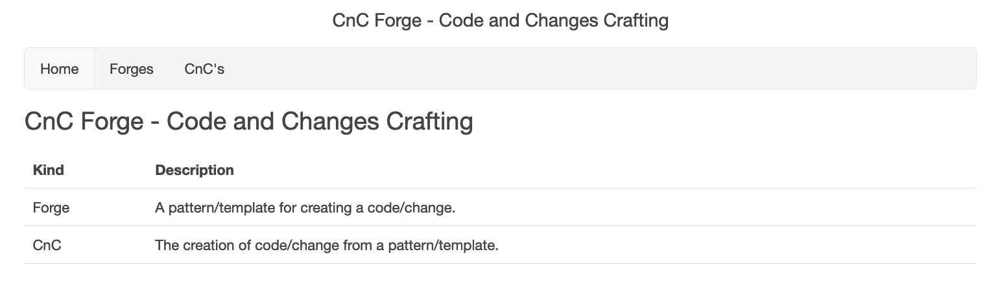
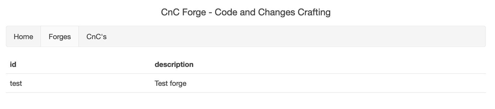
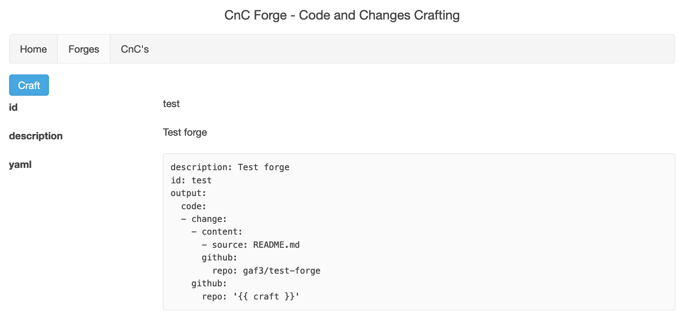
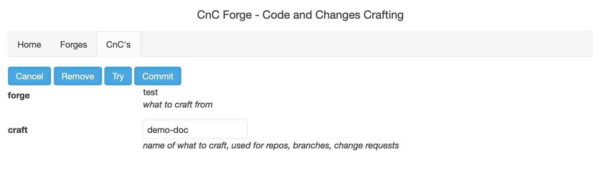
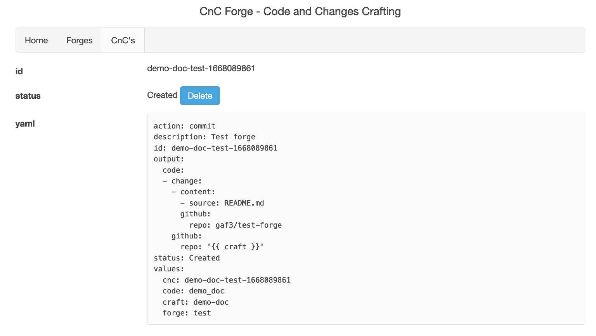
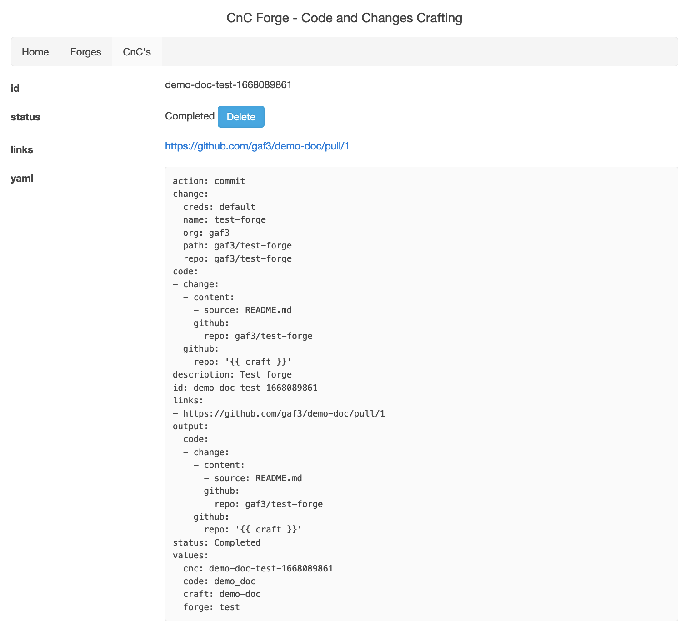
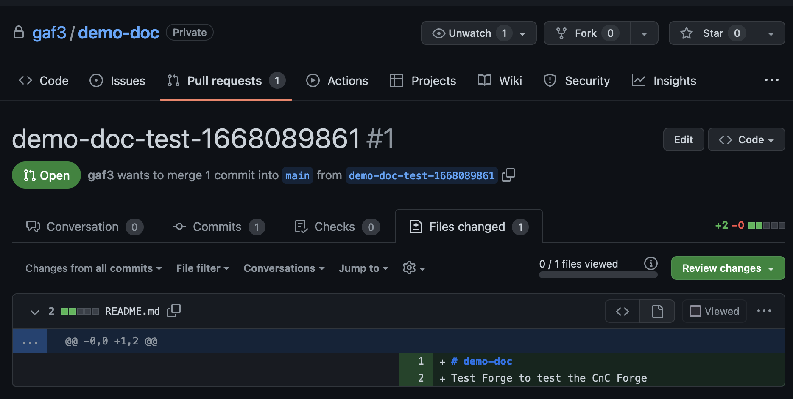
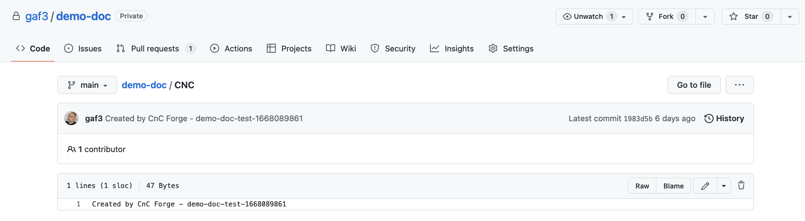

# cnc-forge

Code and Changes Forge - Templating Engine that creates Repos and Pull Requests from Inputs, Repos and Branches.

The CnC Forge handles the boiler plate of any coding process. From simple scripts, to applications, to IasC.

In this age of open source frameworks, we repeat a lot of code. While DRY is a great ideal, it's just that. In
practice, we dance on the minutiae of repeating the same names, creating the same YAML files, or even directory
structures. Getting started can often be the biggest and unfortunately first hurdle.

In this age of corporate standardization, there are all sorts of rules and they vary from workplace to workplace.
There is no universal "right way" for much of anything and instead each workplace has various systems that to
work together, little snippets of code need to be just right. Furthermore, each workplace has an agreed set of
standards for coding that is eessential for working together but tedious to implement and cantankerous to enforce.

The CnC Forge came about from my repeatedly (and originally independently) solving those two problems. The version
here is really the 5th or 6th depending how you look at it (or what I remember). I found myself using the same
patterns over and over again and wanted to focus on the real work. I also found companies struggling to implement
new standards when us programmers like to do things our own ways (that are vastly superior to anyone else's). In
both cases, I found that something that spit out the busywork made getting started easier and proliferated new
standards simply because it was easier to get started this way with the standards already in place.

The CnC Forge allows you to define forges, a coding pattern you typically perform. Within that forge, you can
define inputs, fields for each part of the process that varies, like the name of a service, or a cluster to
deplopy to. You can then define outputs, what repos to create pull requests on or even to create from scratch, and
what repos to pull code from, what files or directories to grab and efen how to add text to specific places in those
files.

Once you have a forge, you can use it create CnC's (code and changes). As a web service, the CnC Forge allows you
to select that forge, fill in the inputs defined in an autogenerated form, and then create the pull requests and/or
repos based on your outputs. Unless specified otherwise, each file in the outputs is treated like a Jinja2 template
with the input values used as the template variables. The result is one or more pull requests (even on a new repo)
that mimic all that tedious work you would have done by hand.

# Forge

A forge is a single YAML file. He's a simple one:

```yaml
description: Test forge
output:
  code:
  - github:
      repo: "{{ craft }}"
    change:
    - github:
        repo: gaf3/test-forge
      content:
      - source: README.md
```

Which we'll put in a file called `test.yaml` and add to a copy of the CnC Forge (more on how later).

Looking at the `README.md` file in that Repo, we can see it's using Jinja2 template for the title name:

```
# {{ craft }}
Test Forge to test the CnC Forge
```

The CNC Forge start here:



Clicking on Forges, we see our test forge, named `test` because we called the file `test.yaml`.



Clicking on that, we see it's entire YAML:



Clickin on Craft we get the form to fill out.



The `craft` field by default is added to every forge (but can be overridden). The CnC Forge use that field
to name the CnC it's going to create. In the case of our test forge, it'll use that field to create a new repo.

Cllicking Commit (we'll go over Try and Remove later) will create a CnC:



Once the CnC is complete, it'll give us a link to all the Pull Requests it created, which is just the one:



Clicking on the PR. we can see there's one file, README.md to add and it's been transformed by Jinja2 to
have our craft `demo-doc`:



We can also see that there's one file in the repo and it's from the forge:



That was done so we could checkout and commit against the repo.

And that's it. It's that simple but can be far more complex.

For more on how input works: [Input](/Input.md)

For more on how output works: [Output](/Output.md)

For more on how the GitHub module works: [GitHub](/GitHub.md)

# Usage

The CnC Forge is a web service made to run in Kubernetes.

Make sure you have:
- A [GitHub](https://github.com/) account that can create Repos and Pull Requests
- A [GitHub Personal Access Token](https://github.com/settings/tokens) that can create Repos and Pull Requests
- A [GitHub SSH Key Pair](https://docs.github.com/en/authentication/connecting-to-github-with-ssh/generating-a-new-ssh-key-and-adding-it-to-the-ssh-agent) without a password with the public key added to the GitHub account.

Wait, isn't that last step dangerous? Oh yes. I'm looking to harden that up but don't ever share what's generated above.

## Local

This is how to run the CnC Forge locally.

I've only tested this on a Mac but it should work with Linux, if with a little finangling. Window? Um, good luck everyone!

Make sure you have installed:
- [Docker Desktop](https://www.docker.com/products/docker-desktop/)
- [Kustomize](https://kustomize.io/)
- [Tilt](https://docs.tilt.dev/install.html)

Setup:
- Check out this repo.
- Create a `secret/` directory (which is .gitignore'd)
- Copy your ssh private key to `secret/github_default.key`
- Create a `secret/github_default.json` file:

```json
{
    "user": "your GitHub username",
    "token": "your GitHub Personal Access Token"
}
```

Running:
- At a bash prompt type `make up`
- Hit space when prompted to open Tilt in a browser
- If any services shows up red, just click the reload circular arrow next to them until green.
- When the GUI service turns green, click on it.
- Look for a localhost link and click on that to enter CnC Forge running locally on your machine.

Forges:
- Just put any forges in `forges/` which was automatically created with `make up`
- It takes few minutes to propagate to the local CnC Forge.
- Updating forges also takes a bit to propagate.

You can speed up the propagation in Tilt by refreshing the API and then the GUI.

Stopping:
- Hit Ctrl-C where you typed `make up`
- Type `make down`

## Production

This is how to deploy the CnC Forge to a production environment where I'm assuming you have a good
understanding of Kubernetes and Kustomize and are down with the IasC.

The CnC Fotge consists of 3 microservices, api, daemon, gui, and a Redis instance. Each has a directory in this Repo with
a `kubernetes\base` directory inside that.

In your IasC repo:

Setup:
- Create a `cnc-forge` directory (or whatever you want, this name doesn't matter)
- Create a `forge/` inside that (this name very much matters) and put your forges within, ie `service.yaml`
- Create a `secret/` inside that and fill it with same GitHub files from Local above
- Create a `kustomization.yaml` next to `forge/`:

```yaml
apiVersion: kustomize.config.k8s.io/v1beta1
kind: Kustomization
namespace: cnc-forge
resources:
- github.com/gaf3/cnc-forge/redis/kubernetes/base/?ref=64f0df412ff86ed8c6c6227e8f539a15e4baacb0
- github.com/gaf3/cnc-forge/api/kubernetes/base/?ref=64f0df412ff86ed8c6c6227e8f539a15e4baacb0
- github.com/gaf3/cnc-forge/gui/kubernetes/base/?ref=64f0df412ff86ed8c6c6227e8f539a15e4baacb0
- github.com/gaf3/cnc-forge/daemon/kubernetes/base/?ref=64f0df412ff86ed8c6c6227e8f539a15e4baacb0
configMapGenerator:
- name: forge
  files:
  - forge/service.yaml
```

Replace `64f0df412ff86ed8c6c6227e8f539a15e4baacb0` with whatever commit hash you want to run (the Repo has tags) and add
any all the forges within `forge/` to the configMapGenerator.

Deploying:
- Make sure you're pointing to the right cluster...
- Type `kubectl create namespace cnc-forge` to create the namespace
- Type `kubectl -n cnc-forge create secret generic secret --from-file secret/` to create the secret
- Type `kubectl apply -k .` to deploy the CnC Forge

NOTE: Make sure you don't commit what's in `secret/`! Also, you probably want to be using some sort of secrets
manager. Just make sure the secret ends up in the pattern above.
