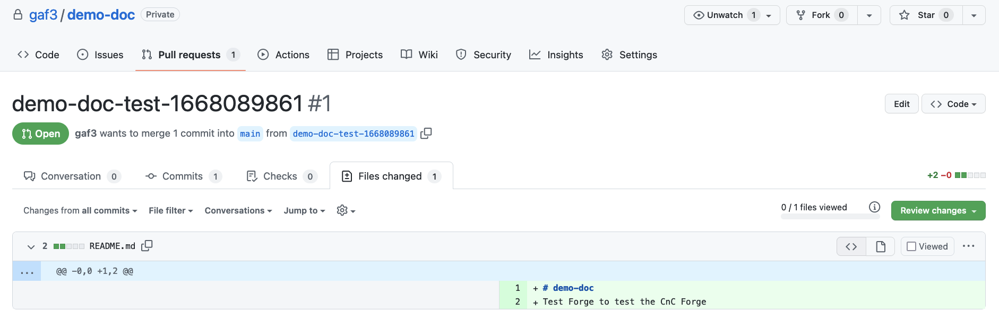

# cnc-forge

Code and Changes Forge - Templating Engine that creates Repos and Pull Requests from Inputs, Repos and Branches.

The CnC Forge handles the boiler plate of any coding process. From simple scripts, to applications, to IasC.

In this age of open source frameworks, we repeat a lot of code. While DRY is a great ideal, it's just that. In
practice, we dance on the minutiae of repeating the same names, creating the same YAML files, or even directory
structures. Getting started can often be the biggest and unfortunately first hurdle.

In this age of corporate standardization, there are all sorts of rules and they vary from workplace to workplace.
There is no universal "right way" for much of anything and instead each workplace has various systems that to
work together, little snippets of code that need to be just right. Furthermore, each workplace has an agreed set of
standards for coding that is eessential for working together but tedious to implement and cantankerous to enforce.

The CnC Forge came about from my repeatedly (and originally independently) solving those two problems. The version
here is really the 5th or 6th depending how you look at it (or what I remember). I found myself using the same
patterns over and over again and wanted to focus on the real work.

I also found companies struggling to implement new standards when us programmers like to do things our own way
(which is vastly superior to anyone else's).

In both cases, I found that something that spit out the busywork made getting started easier and proliferated new
standards simply because it was easier to get started this way.

The CnC Forge allows you to define forges, a coding pattern you typically perform. Within that forge, you can
define inputs, fields for each part of the process that varies, like the name of a service, or a cluster to
deplopy to. You can then define outputs, what Repos to create Pull Requests on or even to create from scratch, and
what Repos to pull code from, what files or directories to grab and even how to add text to specific places in those
files.

Once you have a forge, you can use it create CnC's (code and changes). As a web service, the CnC Forge allows you
to select that forge, fill in the inputs defined in an autogenerated form, and then create the Pull Requests based
on your outputs. Unless specified otherwise, each file in the outputs is treated like a Jinja2 template with the
input values used as the template variables. The result is one or more Pull Requests (even on a new Repo) that perform
all that manual tedious work.

# Forge

A forge is a single YAML file. He's a simple one:

```yaml
description: Test forge
output:
  code:
  - github:
      repo: "{{ craft }}"
    change:
    - github:
        repo: gaf3/test-forge
      content:
      - source: README.md
```

Which we'll put in a file called `test.yaml` and add to a copy of the CnC Forge (more on how later).

Looking at the `gaf3/test-forge/README.md`, we can see it's using Jinja2 templating for the title name:

```
# {{ craft }}
Test Forge to test the CnC Forge
```

The CNC Forge starts here:


Clicking on Forges, we see our test forge, named `test` because we called the file `test.yaml`.


Clicking on that, we see it's entire YAML:


Clicking on Craft, we get the form to fill out.


The `craft` field by default is added to every forge (but can be overridden). The CnC Forge use that field
to name the CnC it's going to create. In the case of our test forge, it'll use that field to create a new Repo.

Cllicking Commit (we'll go over Try and Remove later) will create a CnC:


Once the CnC is complete, it'll give us a link to all the Pull Requests it created, which in this case is just
the one:


Clicking on the PR. we can see there's one file, `README.md`, to add and it's been transformed by Jinja2 to
have our craft `demo-doc`:



We can also see that there's one file in the Repo and it's from the forge:


That was added by the CnC Forge so it could checkout and commit against the Repo.

And that's it. It's that simple but can be far more complex.

For more:
- Local and Production [Setup](/Setup.md)
- How [Forging](/Forging.md) works in general
- How [Templating](/Templating.md) works in general
- How [Input](/Input.md) works
- How [Output](/Output.md)works
- Working with [GitHub](/GitHub.md)
- Some tips and tricks for [Developing](/Developing.md)
